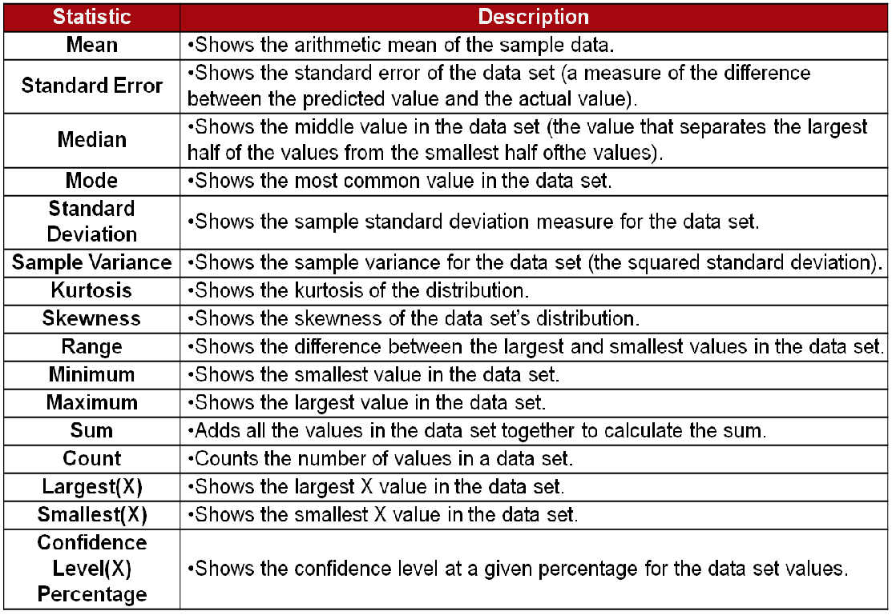

## What are descriptive statistics?
It’s the most common data analysis tool in Excel 

## Why do we need descriptive statistics? 
It summarizes the data to understand easily. It’s usually used in presenting a quantitative analysis of data.  

For example, if we had the results of 100 pieces of students' coursework, 
we may be interested in the overall performance of those students. 
We would also be interested in the distribution or spread of the marks

## Measures of Central Tendency
Measures of central tendency are the most basic and, often, the most informative description of a population's characteristics. 
They describe the "average" member of the population of interest. 
There are three measures of central tendency:
 * Mean -- the sum of a variable's values divided by the total number of values
 * Median -- the middle value of a variable
 * Mode -- the value that occurs most often
 
Example:The incomes of five randomly selected people in the United States are $10,000, $10,000, $45,000, $60,000, and $1,000,000.
  * Mean Income = (10,000 + 10,000 + 45,000 + 60,000 + 1,000,000) / 5 = $225,000
  * Median Income = $45,000 
  * Mode Income = $10,000
  
The mean is the most commonly used measure of central tendency. 
Medians are generally used when a few values are extremely different from the rest of the values (this is called a skewed distribution).
For example, the median income is often the best measure of the average income because,
while most individuals earn between $0 and $200,000, a handful of individuals earn millions.

Source : [Descriptive Statistics](https://www.researchconnections.org/childcare/datamethods/descriptivestats.jsp)

## HOW TO CREATE DESCRIPTIVE STATISTICS
## Step 1. Check your types & missing data

What kind of data is in the column?
* If it’s quantitative (numbers) - leave missing values blank. (This is controversial. Browman and Woo prefer an indicator like "-" or "NA"). Math will work better with missing values instead of mixed values in numeric columns.
* If it’s strings/text, label missing values as “unknown” or “missing” or "NA" if you want. If the text is “category” or “label” data, try to be consistent so you can count these or group them.
* Try not to mix types... Excel won't like this.

### Descriptive Statistics in Windows

This will only work on numeric data.  You must be sure to remove all non-numeric data from the column before you can use the feature.

In the Facebook data column for audience size, you must remove rows that have "-" or a word in them.  (Hint: Use filters and sorting to find them.)

Video: [Removing non-numeric rows](https://youtu.be/8WdZciRZkuE)

## Step 2. Add-ins that help profile your data

* Analysis Toolpak add-in on Windows Excel and
Mac Excel 2016
* On Mac Excel 2011, a third party solution: StatPlus
* Also the Toolpak add-in to Google sheets

### Analysis Toolpak on Windows

* Fichier > Informations > options > complements > analysis Toolpak > atteindre > analysis tookpak, euro currency tools

Help : [Link to Toolpak info](http://www.excel-easy.com/data-analysis/analysis-toolpak.html)

Video: [Adding the analysis toolpak into your Excel on Windows](https://youtu.be/ZiwVY9DZ6RQ)

### Add-In on Mac

StatPus:

Run the app, then add it to Excel from its menu:

Relaunch Excel after choosing “Enable”. You should see these menus added on top...

Import a file with numeric data, like Paris_Rainfall.csv.

Pick Descriptive Statistics from the menu:

Add as many columns as you want to analyse (select on the left, click the arrow on the top).

It will computer results in a new spreadsheet for you.
For Mac, choose to include the histogram (option at the bottom).

## The result example 

## How to analyze the result

